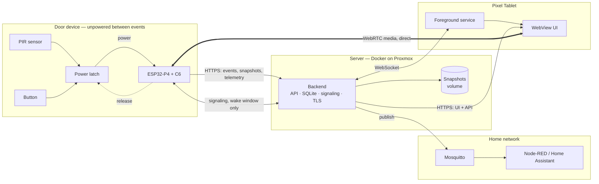

# System architecture

How the system is put together, and why it looks the way it does.

This is the entry point. Detail lives in [`architecture/`](architecture/):

- [`architecture/sequences.md`](architecture/sequences.md) — ring, motion, live call, failures
- [`architecture/firmware-state-machine.md`](architecture/firmware-state-machine.md)
- [`architecture/configuration.md`](architecture/configuration.md)

The decisions behind it are in [`adr/`](adr/). Nothing here contradicts them; where this
document explains a mechanism, the ADR explains the choice.

---

## 1. The shape of the system



The one thing to notice: **media does not pass through the server.** The backend brokers
the introduction and then steps out of the way (ADR-001).

---

## 2. Components

### Door device

An ESP32-P4 with an ESP32-C6 for Wi-Fi over SDIO, plus camera, PDM microphone, I2S
amplifier, PIR and button. It has **no persistent power state**: a hardware latch connects
it to the supply when the PIR or the button fires, and the firmware releases that latch
when its work is done.

Everything else about the firmware follows from this. There is no idle loop, no
long-running connection, no scheduled task. Each activation is a complete lifecycle from
cold boot to power-off.

### Backend

One container. Serves the API and the web UI on one origin over TLS, stores events and
telemetry in SQLite and snapshots on a volume, publishes to MQTT, relays WebRTC signaling,
and holds WebSocket connections to the tablets.

It is the only component that is continuously available, which is why it — and not the
device — owns anything that must be true between events: MQTT availability (ADR-002),
device state, and wall-clock timestamps.

### Tablet

A native Android shell whose foreground service holds the WebSocket, with the UI rendered
in a WebView (ADR-003). The shell exists for one reason: to turn the screen on and raise
the app when the doorbell rings.

### Broker and consumers

Mosquitto and its consumers are **external**. The system publishes to them and expects
nothing back — the data flow is one-way by decision (ADR-002).

---

## 3. Data flows

| Flow | Transport | Direction | When |
| --- | --- | --- | --- |
| Events, snapshots, telemetry | HTTPS | device → backend | per activation |
| WebRTC signaling | HTTPS, device-initiated | device ↔ backend | wake window only |
| Live media | WebRTC / DTLS-SRTP | device ↔ tablet, direct | live session only |
| Home automation | MQTT | backend → broker | on event, and on state change |
| Ring and status | WebSocket | backend ↔ tablet | continuous |
| UI and API | HTTPS | backend → tablet | continuous |

**The device never accepts an inbound connection.** It cannot: it is usually unpowered,
and when it is powered it is behind whatever the LAN provides. Every exchange is
device-initiated, including signaling — the device opens the signaling channel after
reporting its event and holds it for the wake window.

---

## 4. Trust boundaries

```text
                    device token
door device  ──────────────────────────►  backend
                                             │
                     user session            │  broker credentials
tablet  ◄────────────────────────────────────┤  (server-side only)
                                             ▼
                                          Mosquitto
```

- **The door device is physically reachable by anyone** who walks up to the house. It
  holds a device token and nothing else — no broker credentials, no user credentials
  (ADR-002). Flash Encryption and Secure Boot v2 protect what is on it.
- **The LAN is not trusted.** TLS everywhere, and the device authenticates with a token
  rather than being trusted by address.
- **Media is encrypted end to end** by DTLS-SRTP, independently of the page certificate.
- **Broker credentials live only on the server.**

---

## 5. Invariants

These hold across every flow. They are the things that must not break.

**The device always powers itself off.** Every path through the firmware — success,
failure, timeout — ends by releasing the power latch. A watchdog enforces a hard maximum
awake time, because the failure mode of a stuck device is a flat battery, not an error
message.

**Nothing retries without a bound.** Not uploads, not Wi-Fi association, not MQTT
reconnection. Bounded retries, then queue locally and shut down.

**The local queue is bounded.** A backend outage must not fill the flash.

**Events are idempotent.** The device generates the event ID and reuses it across retries,
so a duplicate upload does not become a duplicate ring in the house.

**The backend owns wall-clock time.** A cold-booting device has no reliable clock, and
spending wake time on SNTP costs energy for something the backend already knows.

**States are retained in MQTT; events are not.** A retained ring would re-fire automations
on every Home Assistant restart (see [`mqtt.md`](mqtt.md)).

---

## 6. The cooldown problem, and where it is solved

This is worth its own section, because it is the one place where the power design creates
a requirement that software cannot meet.

The brief requires a configurable cooldown so that continuous motion does not cause
continuous capture. **The device cannot implement it**: during the cooldown it is
unpowered, so it holds no timer and runs no code. If the PIR asserts again the moment the
latch releases, the device boots again immediately, and sustained motion becomes sustained
booting — precisely the failure the requirement exists to prevent.

It is solved in hardware, by combining two properties:

1. **The latch is edge-triggered**, set on the PIR's rising edge rather than by its level.
   A latch that is level-triggered would re-power the device instantly, because the PIR
   output is still high when the firmware releases it.
2. **The PIR's own hold time is the cooldown.** While the sensor holds its output high
   there is no new rising edge, so no new activation is possible.

This is why the PIR choice changed to one with an **adjustable hold time**; see
[`hardware.md`](hardware.md). The cooldown becomes a potentiometer rather than a
configuration value, which is a genuine loss of flexibility and is recorded as such.

The backend still enforces a cooldown of its own, but for a different purpose: rejecting
duplicate or too-frequent events protects the *data*, not the battery. By the time an
event reaches the backend the energy is already spent.

---

## 7. What this architecture does not do

Stated plainly so it is not mistaken for an oversight:

- **No spontaneous live view.** The tablet cannot call a sleeping device.
- **No periodic telemetry.** Battery and status ride along with events.
- **No command channel** from home automation to the device.
- **One live viewer at a time**, though all tablets are notified.
- **No remote access.** LAN only.
- **No push when the app is closed and there is no internet** — which is why the tablet
  runs a native shell holding a local connection instead.
