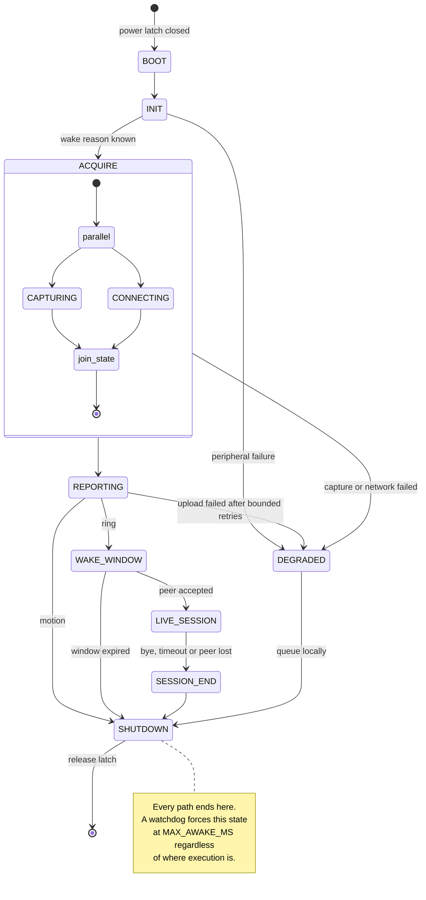

# Firmware state machine

Deliverable 8 of the project brief.

The brief proposes states including `IDLE` and `LOW_POWER`. **Those states do not exist
here.** The device is unpowered between activations, so there is nothing to idle in. Each
activation is a complete lifecycle: cold boot, do the work, release the latch, cease to
exist.

That is the single idea this diagram expresses.

---

## States

---

## What each state does, and what is powered

| State | Purpose | Camera | Audio | Radio | Typical |
| --- | --- | :---: | :---: | :---: | --- |
| `BOOT` | ESP-IDF startup, latch held | off | off | off | ~1 s |
| `INIT` | Read wake reason, battery, init peripherals | starting | off | starting | ~0.5 s |
| `ACQUIRE` | Capture snapshot **and** associate Wi-Fi, in parallel | **on** | off | **on** | ~5 s |
| `REPORTING` | POST event, snapshot, telemetry | off | off | on | ~2 s |
| `WAKE_WINDOW` | Signaling channel open, waiting for a peer | off | off | on | up to `WAKE_WINDOW_MS` |
| `LIVE_SESSION` | WebRTC media both ways | **on** | **on** | **on** | up to `LIVE_SESSION_TIMEOUT_MS` |
| `SESSION_END` | Tear down peer, final telemetry | off | off | on | ~1 s |
| `DEGRADED` | Bounded retries exhausted; queue locally | off | off | maybe | ~1 s |
| `SHUTDOWN` | Flush queue, release latch | off | off | off | ~0.5 s |

The camera is off in `WAKE_WINDOW`. Holding it ready would shorten time-to-first-frame if
a call is accepted, but it would burn camera power through every unanswered ring — and
most rings are answered quickly or not at all. If measurement later shows the restart cost
dominates, this is the first thing to revisit.

---

## Why motion skips the wake window

`REPORTING` branches on wake reason:

- **Ring** → `WAKE_WINDOW`. Somebody is at the door and may want to talk.
- **Motion** → `SHUTDOWN`. Nobody is waiting for a conversation, and holding the radio
  open for a passing cat is the most wasteful thing the device could do.

At roughly 20 motion events a day, a 60-second wake window on each would cost more than
everything else in the budget put together. Motion reports and leaves.

---

## The invariants

These are not stylistic. Each one exists because violating it flattens the battery.

**Every path reaches `SHUTDOWN`.** There is no terminal error state, no "wait for
operator", no retry loop that can outlive its budget. `DEGRADED` is not a resting place —
it queues what it could not send and moves on.

**A watchdog forces `SHUTDOWN` at `MAX_AWAKE_MS`.** Unconditional, independent of the
state machine, and it must be armed before anything else can fail. A device stuck in
`ACQUIRE` because Wi-Fi association hangs is indistinguishable from a dead battery a week
later.

**Retries are bounded and counted.** Wi-Fi association, uploads, signaling — each has a
maximum attempt count and a maximum elapsed time, and the elapsed-time bound is what
actually protects the budget.

**The latch release is the last instruction.** Not a callback, not a deferred task. If
anything can run after it, something can prevent it.

**Failure is cheaper than success.** A device that cannot reach the network should power
off faster than one that succeeds, not slower. Getting this backwards is how an unreachable
backend turns into a flat battery overnight.

---

## Wake reason

Determined in `INIT` and carried through every event and log line, because it is the first
thing anyone debugging will want:

| Reason | Source |
| --- | --- |
| `button` | Latch set by the doorbell button |
| `motion` | Latch set by the PIR |
| `unknown` | Latch closed but neither line asserted — a fault worth reporting |

`unknown` is not padding. If it appears in telemetry, something in the power path is
misbehaving, and that is exactly the class of problem that would otherwise show up only as
unexplained battery drain.

---

## Timings

All configurable; see [`configuration.md`](configuration.md).

| Parameter | Suggested default | Rationale |
| --- | --- | --- |
| `WAKE_WINDOW_MS` | 90 s | Long enough to walk to the tablet, short enough that an unanswered ring costs ~10 mAh |
| `LIVE_SESSION_TIMEOUT_MS` | 120 s | A doorbell conversation is short; the limit protects against a session nobody ended |
| `MAX_AWAKE_MS` | 180 s | Watchdog backstop, above every legitimate path including a full session |
| `UPLOAD_RETRY_MAX` | 3 | Beyond this the network is not coming back within this activation |
| `UPLOAD_TIMEOUT_MS` | 5 s | Per attempt |
| `WIFI_CONNECT_TIMEOUT_MS` | 15 s | Three times the assumed association time |

These defaults are proposals, not measurements. `WAKE_WINDOW_MS` in particular is a
direct energy trade — see [`../power-budget.md`](../power-budget.md), where an unanswered
ring is modelled at roughly 10 mAh.
