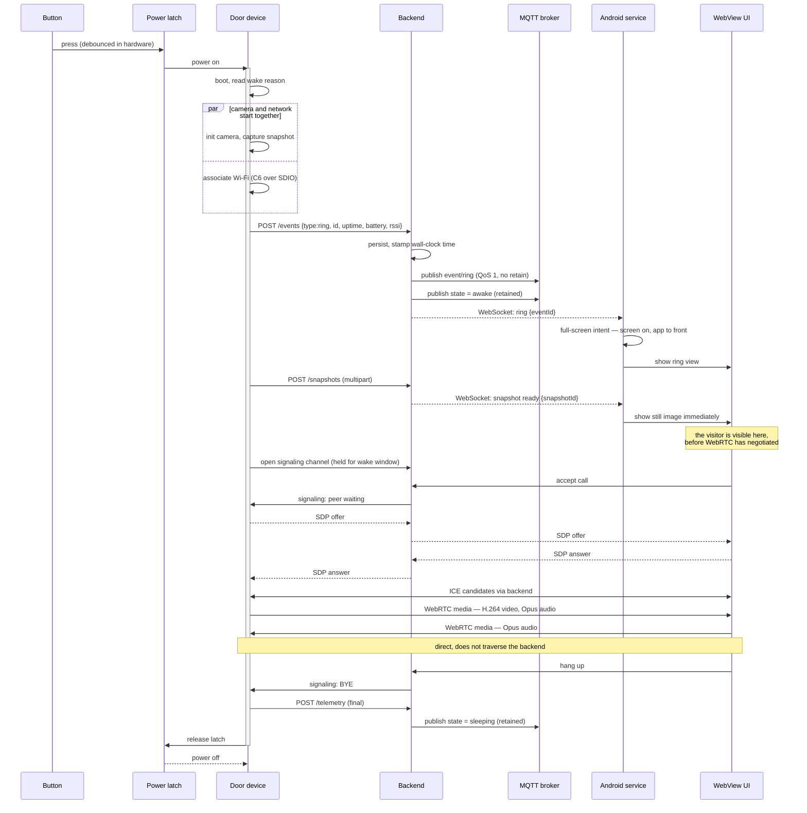
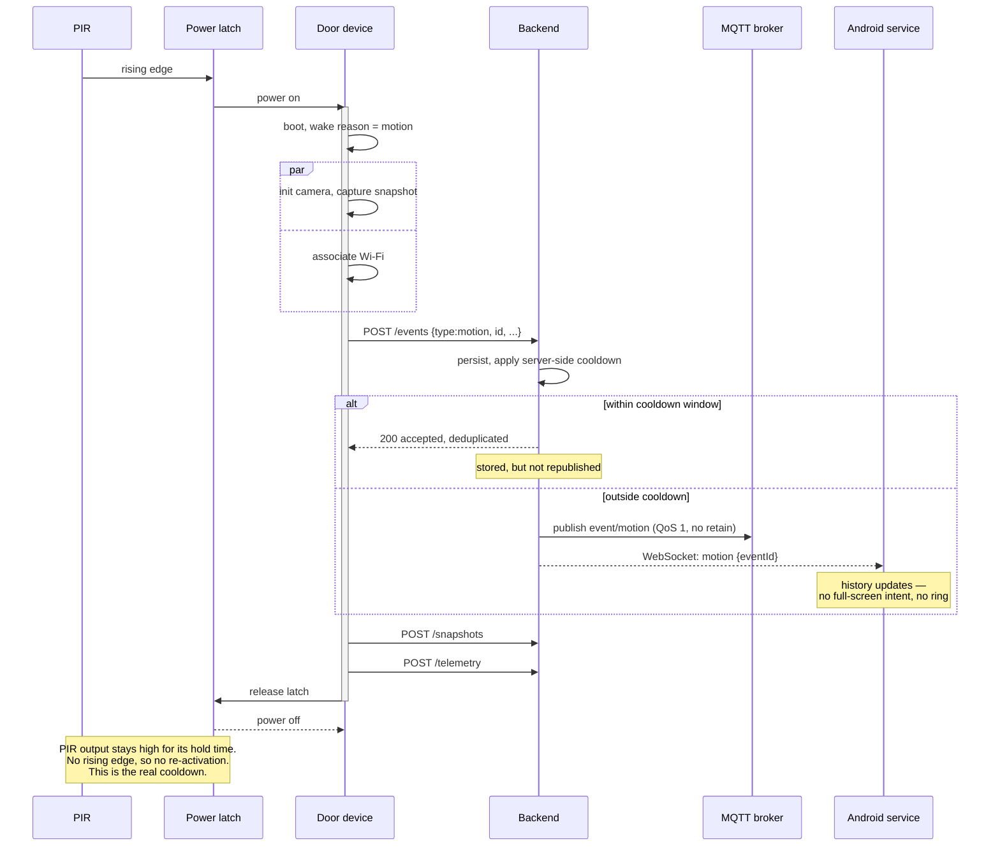
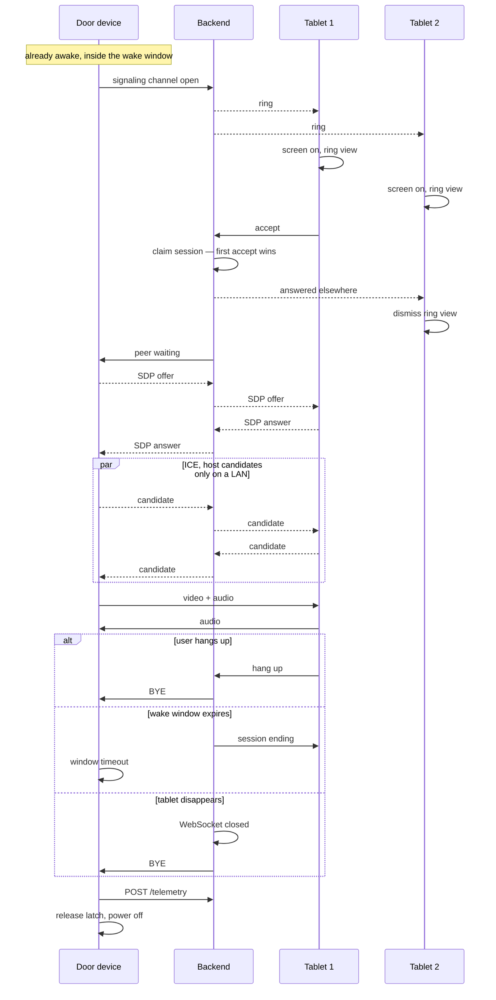
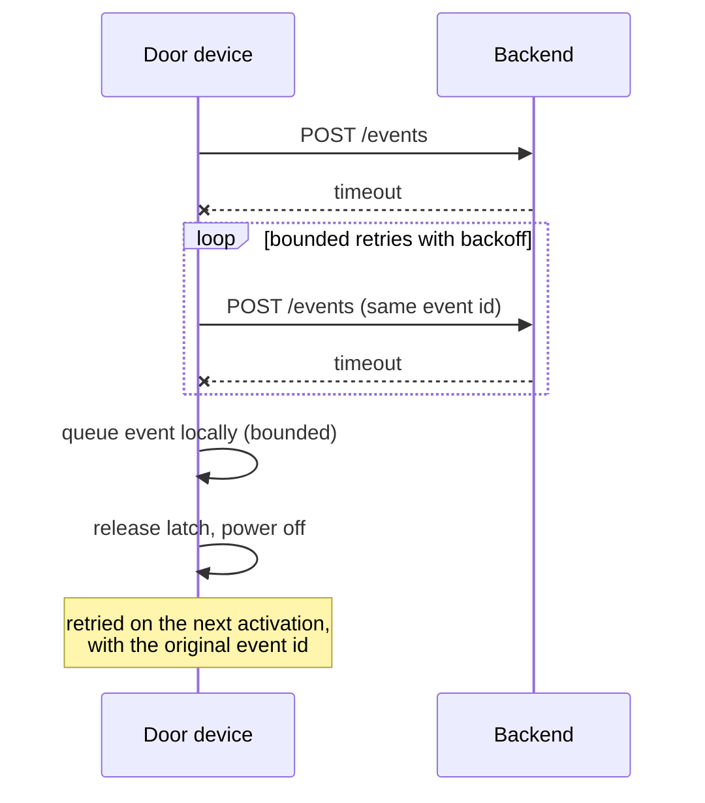

# Sequence diagrams

The three core flows, plus the failure paths that shape them.

Read [`../architecture.md`](../architecture.md) first for the component picture.

---

## 1. Doorbell ring

**Why the snapshot appears before the video.** Time to first frame is dominated by the
cold boot, not by WebRTC. The snapshot is being captured anyway, so showing it the moment
it arrives puts the visitor on screen while negotiation is still running. This costs
nothing and hides most of the setup latency (ADR-001).

**Why camera and Wi-Fi start in parallel.** Both are on the critical path and neither
depends on the other. Serialising them would add roughly three seconds of camera warm-up
to every activation, paid in energy as well as latency.

---

## 2. Motion

**Motion must not ring.** The full-screen intent is reserved for the button. A motion
event that seized the screen would make the tablet unusable on a windy day — and would
train the user to ignore it.

**The cooldown is hardware.** See [`../architecture.md`](../architecture.md) section 6.
The server-side cooldown that appears here protects the event history from duplicates; it
cannot protect the battery, because by the time the request arrives the energy is spent.

---

## 3. Live session

**First accept wins.** Several tablets are notified but only one holds media
([`../planning/constraints.md`](../planning/constraints.md)). The others are told
explicitly that the call was answered — a ring view that simply stops is
indistinguishable from a broken app.

**Every ending leads to the same place.** Hang-up, timeout and disconnection all converge
on teardown and power-off. There is no path where the device stays awake because nobody
told it to stop.

---

## 4. Failure paths

The brief lists nine failure situations. The ones that shape the design:

### Backend unreachable

**It gives up and sleeps.** An unbounded retry loop against a dead server is the most
expensive thing this device could do. The event is not lost — it is queued, with its
original ID so the eventual delivery does not duplicate.

The queue is bounded and drops oldest-first when full. A server outage must not fill the
flash.

### Live session setup fails

ICE fails, or the tablet never answers. The device holds the signaling channel until the
wake window expires, then tears down and powers off. **The wake window is the backstop for
every live-session failure** — there is no separate error path that could itself hang.

### No one answers the ring

The wake window expires, the device powers off, and the backend publishes state
`sleeping`. The tablets show a missed ring. The snapshot is already stored, so the user
sees who called.

### Backend restarts mid-session

The signaling channel drops. The device's wake window continues and expires normally.
Media already established would survive briefly — it is direct — but signaling and
teardown are gone, so the session ends at the window boundary rather than cleanly.
Acceptable: the backend is a single container with a restart policy, and the device
protects itself with the window.

### Device stops responding while awake

A watchdog forces power-off at the maximum awake time regardless of state. This is the
last line of defence for the battery and it is unconditional; see
[`firmware-state-machine.md`](firmware-state-machine.md).
