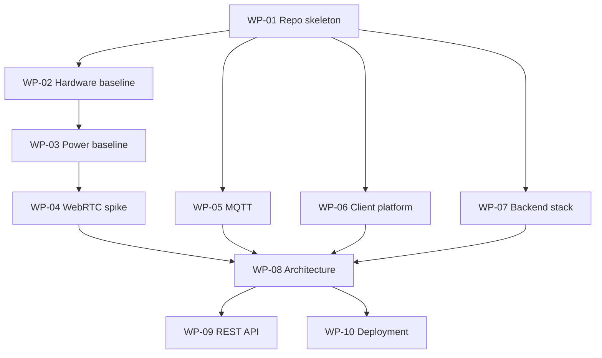

# Roadmap

The plan of record for this project. This file is the index and the single source of
truth for work-package status; the individual documents under `work-packages/` hold the
detail.

Read these first — they constrain almost everything here:

- [`constraints.md`](constraints.md) — decisions the maintainer has set
- [`../hardware.md`](../hardware.md) — what the device is built from
- [`../power-budget.md`](../power-budget.md) — why the design looks the way it does

---

## How this is organised

Work is cut into **work packages** (WP). Each has a document under
[`work-packages/`](work-packages/) with a goal, a task checklist, named deliverables and
acceptance criteria that can actually be checked.

Phase 0 is detailed in full below, because it is what we do next. Phases 1 to 7 are
sketched only. Their cut depends on decisions that have not been made yet — above all
ADR-001 — and writing seventeen speculative documents now would be the over-design that
AGENTS.md section 4 rules out. Each phase gets detailed when it
starts.

Status values: `todo`, `in progress`, `blocked`, `done`.

---

## Phase 0 — architecture and technical spikes

| WP | Title | Status | Depends on | Main deliverable |
| --- | --- | --- | --- | --- |
| [WP-01](work-packages/WP-01-repository-skeleton.md) | Repository skeleton and planning | done | — | this roadmap, `docs/hardware.md` |
| [WP-02](work-packages/WP-02-hardware-baseline.md) | Hardware baseline and component selection | in progress | WP-01 | `docs/hardware.md` |
| [WP-03](work-packages/WP-03-power-baseline.md) | Power baseline and budget | done | WP-02 | `docs/power-budget.md` |
| [WP-04](work-packages/WP-04-spike-webrtc.md) | WebRTC architecture spike | done | WP-03 | `docs/adr/ADR-001-webrtc-architecture.md` |
| [WP-05](work-packages/WP-05-spike-mqtt.md) | MQTT architecture and topic schema | done | WP-01 | `ADR-002`, `docs/mqtt.md` |
| [WP-06](work-packages/WP-06-client-platform.md) | Client platform decision | done | WP-01 | `docs/adr/ADR-003-client-platform.md` |
| [WP-07](work-packages/WP-07-backend-stack.md) | Backend stack decision | done | WP-01 | `docs/adr/ADR-004-backend-stack.md` |
| [WP-08](work-packages/WP-08-system-architecture.md) | System architecture and diagrams | done | WP-04, WP-05, WP-06, WP-07 | `docs/architecture/` |
| [WP-09](work-packages/WP-09-api-design.md) | REST API design | done | WP-08 | `docs/api/openapi.yaml` |
| [WP-10](work-packages/WP-10-deployment-topology.md) | Deployment topology | done | WP-08 | `deploy/`, `docs/architecture/deployment.md` |

### Dependencies

WP-05, WP-06 and WP-07 are independent of the power question and can run in parallel with
the WP-02 → WP-03 → WP-04 chain.

### The power question, and how it resolved

WP-03 deliberately blocked WP-04, because the viable live-video architectures differ
depending on whether the device idles cheaply or is switched off entirely between events.

It is now answered. The board's 31.5 mA deep-sleep draw costs ~1220 mAh/day, needing a
~12 W panel and a ~21 Ah cell — not a doorbell. With an external latching load switch the
board is fully unpowered between events: ~58 mAh/day, a 2 W panel and a 3000-5000 mAh
cell. **A factor of about 21**, so the load switch is a requirement of the design rather
than an optimisation.

The consequence for everything downstream: **the device cold-boots on every wake and is
unreachable in between**. No persistent signaling connection, no spontaneous live view,
and every session pays boot plus Wi-Fi association before ICE begins.

The budget is calculated from vendor figures, not measured — no measurement equipment is
available. Its assumptions are listed and its sensitivity analysis shows the conclusion
survives every plausible combination of them being wrong. See
[`../power-budget.md`](../power-budget.md).

---

## Coverage of the project brief

The brief lists twelve deliverables for the first result (its section 35). Each maps to
exactly one work package:

| # | Deliverable | WP |
| --- | --- | --- |
| 1 | System architecture diagram | WP-08 |
| 2 | Sequence diagram: doorbell ring | WP-08 |
| 3 | Sequence diagram: motion | WP-08 |
| 4 | Sequence diagram: live call | WP-08 |
| 5 | Comparison: direct WebRTC vs Espressif doorbell vs Janus | WP-04 |
| 6 | Comparison: MQTT via backend vs direct vs hybrid | WP-05 |
| 7 | Client recommendation: web vs native Android | WP-06 |
| 8 | Firmware state machine | WP-08 |
| 9 | Proposed REST API | WP-09 |
| 10 | Proposed MQTT schema | WP-05 |
| 11 | Docker Compose target architecture | WP-10 |
| 12 | List of hardware parameters still needed | WP-02 |

---

## Phases 1 to 7 — sketch

Not yet detailed. Listed so the shape of the whole is visible and so dependencies
across phases are not missed.

**Phase 1 — base firmware.** Hardware abstractions (`board_config`, `NetworkInterface`,
camera, audio, motion, button, battery), the state machine, and the HTTP client. Target:
`motion -> wake -> snapshot -> upload -> power off` and
`button -> wake -> doorbell event -> backend`. Blocked by WP-09 (the API it uploads to).

Two things are specific to this design: the firmware's final act in every cycle is
**releasing the power latch**, so there is no idle state to return to; and wake-to-network
time should be logged from the first boot, because it is the least certain input in the
power model and costs nothing but a timestamp.

Flash Encryption and Secure Boot v2 belong at the *end* of this phase — both are
supported on the ESP32-P4 and both are irreversible once burned.

**Phase 2 — backend.** Node.js/TypeScript per WP-07, in Docker. Device registry, event
and snapshot intake, telemetry, persistence, MQTT publishing per ADR-002, health checks,
tests. End-to-end target: `ESP button -> backend -> MQTT` and
`ESP motion -> snapshot -> backend -> storage`.

**Phase 3 — client.** Per ADR-003 this is now **two pieces**: a native Android shell and
the web UI it hosts.

The shell is small but not optional — a foreground service holding the WebSocket, a
notification channel, and a full-screen-intent activity that turns the screen on and
raises the app when the doorbell rings. It also needs `network_security_config.xml` to
trust the user-installed CA, and `onPermissionRequest` plumbing so WebRTC works in the
WebView.

The UI is web: device status, ring view, motion and snapshot history, error display,
reconnect. Deliberately ahead of WebRTC, since everything except live media can be built
against the backend alone.

Budget for three one-time setup steps that all fail *silently* if skipped: installing the
CA certificate, granting the full-screen-intent permission, and exempting the app from
battery optimisation. Onboarding has to detect and explain each.

**Phase 4 — WebRTC.** Implement the ADR-001 architecture. Target: camera and microphone
from device to tablet, tablet microphone to device speaker. Measure connection setup
time and latency. Note the constraint already found: the Espressif doorbell examples do
two-way audio with **one-way video** (device to browser), which matches the product, but
`janus_demo` ships as publisher-only and would need a subscribe path added for the return
audio.

**Phase 5 — Janus integration.** Only if ADR-001 selects Janus. Container, configuration,
backend-driven session lifecycle, ICE and UDP port ranges, cleanup, reconnect,
monitoring restricted to the internal network.

**Phase 6 — power validation.** The budget in `docs/power-budget.md` already exists as a
calculation; this phase replaces its assumptions with reality. Some of that needs no
equipment — wake-to-network, camera start, upload duration and session length are all
log timestamps, and they are four of the least certain inputs. Currents still need
measurement, and the single most valuable one is the power module quiescent draw: it is
97 % of the idle load and 44 % of the daily budget. Update the model in place rather than
rewriting it, and keep the [V]/[A] tagging honest.

**Phase 7 — robustness.** Network loss, backend restart, Janus restart, MQTT outage,
repeated ringing, continuous motion, browser restart, device restart, battery running
flat. Verify that no failure mode produces an unbounded retry loop.

---

## Working agreements

- Repository content — code, comments, documentation, commit messages — is **English**.
  Conversation with the maintainer is German. (AGENTS.md section 2.)
- One work package per branch, merged via pull request. No direct pushes to the default
  branch. (AGENTS.md section 9.)
- A work package is done when its acceptance criteria are met, not when its tasks are
  ticked.
- Facts about external systems get verified against source or official documentation
  before being relied on, and the distinction between verified fact, assumption,
  recommendation and open question stays visible in the documents.
  (AGENTS.md section 3.)
